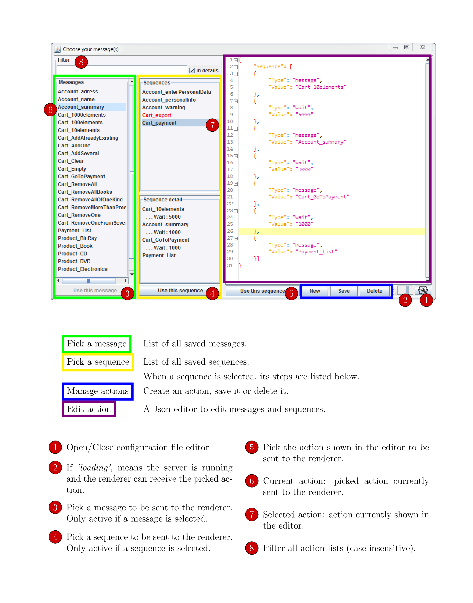

# socket-sender-gui
Simulate sending messages or sequences of messages from a websocket server, with a GUI to manage them.

If you're working on an application that communicates with a browser through websockets
(can be adapted to HTTP requests as well)
and wish to work on given actions without having to start long sequences of actions again and again,
you might want to simulate the sending of a given message.
Or of a given sequence of messages.

This tool is basically a GUI around a minimal websocket server that automatically send whatever message you selected on a connection event.

It was originally created to deal with Json messages, but can be easily adapted to treat messages in any language (or none in particular). 

 [Quick Overview](#sec_quickOverview)  
 [Detailed Manual](#sec_detailedManual)  
 [External code](#sec_externalCode)  
 [Known issues](#sec_knownIssues)  
 [Future development](#sec_future)  

### Quick overview
<a name="sec_quickOverview"/>

  

### Detailed manual
<a name="sec_detailedManual"/>

If the interface does not seem intuitive enough, click [here](documentation/latex/SocketSenderGui.pdf) to get a full manual (pdf).

### External code
<a name="sec_externalCode"/>

#### Partial use of third party code

*JsonMinify*: by Stefan Reich at http://tinybrain.de:8080/jsonminify/

#### Libraries and modules

*RSyntaxTextArea*: by Bobbylight at http://bobbylight.github.io/RSyntaxTextArea/

*Grizzly*: by Oracle at https://javaee.github.io/grizzly/

*Gson*: by Google at https://github.com/google/gson

### Change the language of messages
<a name="sec_languageOfMessages"/>

### Known issues
<a name="sec_knownIssues"/>

When editing an action, there is no way to see an already existing action without loosing the current edits.
A current roundabout this issue is to "Select All / Copy" in the editor,
go see the other action and re-create or modify.

A fix can be of two sorts:
- add a _Back_ button and memorize all changes. There probably is a java library for that
- add a read-only editor on interaction with an action in the list

We prefer tha latter solution but have to think about the user flow before implementing it.

### Future developments
<a name="sec_future"/>

1) Externalize new message snippet
